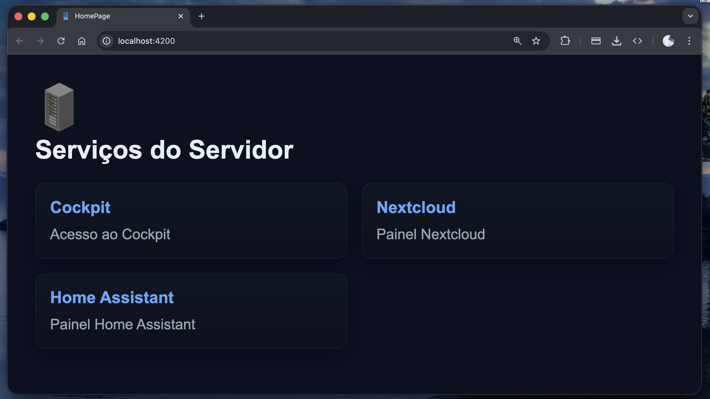

# HomePage
## Sobre o projeto
Esse projeto é uma página inicial com o objetivo de anexar links, sendo o ponto de partida de um homelab, anexando links por meio de um arquivo Json para fácil gerenciamento.

## Imagem do projeto


# Como executar localmente
1. Instalar o Angular CLI globalmente, caso ainda não tenha:
   ```bash
   npm install -g @angular/cli
   ```
2. Use  node versão 24

3. Instale o Angular CLI globalmente, caso ainda não tenha:
   ```bash
   npm install -g @angular/cli
   ```
4. Instale as dependências do projeto:
   ```bash
   npm install
   ```

5. Inicie o servidor de desenvolvimento:
   ```bash
   ng serve
   ```

# Como usar em um HomeLab
Execute a aplicação em um container Docker, utilizando a porta 80 para acesso, utilize Volume para o arquivo `links.json` para fácil gerenciamento dos links.